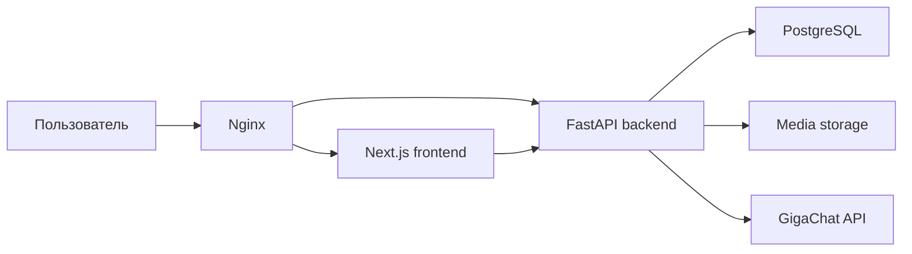

# HedgehogCRM

**HedgehogCRM** — веб-приложение класса CRM, разработанное для автоматизации работы IT-академии. Система объединяет управление учениками и родителями, расписанием занятий, посещаемостью, отработками, сделками, задачами, сотрудниками, аналитикой и интеллектуальным AI-модулем на базе GigaChat.

Приложение предназначено для администраторов, менеджеров и преподавателей образовательной организации. HedgehogCRM обеспечивает единое цифровое пространство для сопровождения клиента от первого обращения до регулярного обучения, контроля посещаемости и анализа учебных рисков.

## Назначение проекта

Цель проекта — разработка CRM-системы для IT-академии, которая автоматизирует основные бизнес-процессы образовательной организации и повышает эффективность работы сотрудников.

Система решает следующие задачи:

- ведение единой базы учеников и родителей;
- хранение контактной информации и учебной истории учеников;
- управление курсами, группами и преподавателями;
- планирование групповых, индивидуальных занятий и отработок;
- ведение электронного журнала посещаемости;
- контроль пропусков, опозданий и комментариев преподавателя;
- организация отработок по пропущенным занятиям;
- управление сделками и задачами;
- анализ активности пользователей и ведение журнала аудита;
- формирование AI-сводок и рекомендаций на основе данных CRM.

HedgehogCRM разработана как полнофункциональное full-stack приложение с отдельным backend API, frontend-интерфейсом, базой данных PostgreSQL и Docker-инфраструктурой для запуска.

## Основные возможности

### Авторизация и пользовательские сессии

В системе реализован модуль аутентификации пользователей:

- регистрация новых пользователей;
- вход в систему по email и паролю;
- хранение паролей в виде bcrypt-хеша;
- выдача JWT access token;
- хранение refresh token в HTTP-only cookie;
- автоматическое обновление access token;
- ротация refresh token;
- выход из системы;
- хранение пользовательских сессий;
- принудительное завершение сессий администратором;
- журналирование действий пользователей.

Такой подход обеспечивает безопасную работу с пользовательскими учетными записями и позволяет контролировать активность сотрудников.

### Ролевая модель

HedgehogCRM поддерживает несколько ролей пользователей:

| Роль | Возможности |
| --- | --- |
| Администратор | Полный доступ ко всем модулям системы, аналитике, архиву, активности пользователей и журналам аудита |
| Менеджер | Работа с клиентами, сделками, задачами, расписанием, отработками и операционной аналитикой |
| Преподаватель | Работа с личным расписанием, группами, учениками, посещаемостью и рекомендациями AI |
| Анонимный пользователь | Начальная роль для новых зарегистрированных пользователей до подтверждения доступа |

Ролевая модель позволяет разграничивать доступ к данным. Преподаватель работает только со своими учениками и группами, а администратор имеет возможность контролировать систему целиком.

### Управление учениками и клиентами

Модуль клиентов предназначен для хранения информации об учениках и их родителях.

В карточке ученика хранятся:

- имя, фамилия и отчество;
- дата рождения;
- ФИО родителя;
- телефон родителя;
- email родителя;
- теги;
- дата создания записи;
- история посещаемости;
- сведения об отработках;
- статистика учебной активности.

Карточка ученика используется менеджерами и преподавателями для быстрого просмотра ключевой информации, оценки посещаемости и принятия решений по дальнейшей работе с учеником.

### Курсы и учебные группы

Система позволяет управлять учебной структурой академии:

- создавать и хранить курсы;
- указывать стоимость курса;
- указывать стоимость одного занятия;
- задавать количество занятий;
- создавать учебные группы;
- назначать преподавателя на группу;
- связывать группу с курсом;
- добавлять учеников в группы;
- указывать расписание и аудиторию.

В системе также поддерживаются временные группы для проведения отработок.

### Расписание занятий

Модуль расписания является центральной частью приложения. Он позволяет планировать и контролировать учебный процесс.

Возможности модуля:

- отображение занятий в календаре;
- фильтрация расписания по преподавателю;
- создание групповых занятий;
- создание индивидуальных занятий;
- создание отработок;
- редактирование занятий;
- перенос занятий с помощью drag-and-drop;
- отмена занятий;
- создание еженедельных повторяющихся занятий;
- архивирование и восстановление занятий;
- хранение темы, комментария и ссылки на материалы;
- отображение статуса занятия.

Календарь адаптирован для работы на компьютерах и мобильных устройствах.

### Электронный журнал посещаемости

Для каждого занятия преподаватель может заполнить электронный журнал.

Доступные статусы посещаемости:

- присутствовал;
- отсутствовал;
- опоздал.

Для каждой записи посещаемости можно указать:

- комментарий преподавателя;
- количество начисленных “хечхогов”;
- связь с отработкой;
- отметку о выполнении отработки.

Посещаемость используется для расчета статистики ученика, формирования AI-сводок, анализа учебных рисков и организации отработок.

### Отработки

В HedgehogCRM реализован отдельный сценарий работы с пропущенными занятиями.

Система позволяет:

- фиксировать пропуск занятия;
- определять, кто отметил отсутствие;
- назначать дату и преподавателя для отработки;
- объединять нескольких учеников в одну сессию отработки;
- отображать отработки в календаре;
- отмечать выполнение отработки;
- хранить комментарий по результату отработки.

Этот механизм помогает академии не терять учебный контекст при пропусках и организовывать компенсационные занятия.

### Сделки

Модуль сделок используется для управления продажами и сопровождения клиентов.

Сделка содержит:

- связь с клиентом;
- ответственного менеджера;
- этап воронки;
- сумму;
- дедлайн;
- статус;
- дату создания и обновления.

Сделки позволяют менеджерам контролировать процесс продажи курса и отслеживать потенциальных клиентов.

### Задачи

Модуль задач предназначен для организации ежедневной работы сотрудников.

Задача содержит:

- название;
- описание;
- исполнителя;
- автора;
- связанного клиента;
- связанную сделку;
- приоритет;
- дедлайн;
- статус.

Задачи могут создаваться вручную или предлагаться AI-модулем на основе обнаруженных учебных рисков.

### Архив

В системе используется мягкое удаление данных. При удалении сущность переносится в архив, а не удаляется физически из базы данных.

В архив могут попадать:

- ученики;
- курсы;
- группы;
- занятия;
- сделки;
- задачи.

Архивные записи можно просматривать, фильтровать, сортировать и восстанавливать.

### Аналитика

Аналитический модуль агрегирует данные по учебному и операционному процессу.

Он используется для оценки:

- посещаемости учеников;
- динамики пропусков;
- активности групп;
- загрузки преподавателей;
- состояния сделок;
- выполнения задач;
- общей эффективности работы академии.

Аналитика помогает администраторам и менеджерам принимать управленческие решения на основе данных.

### Сотрудники

Модуль сотрудников предоставляет справочник пользователей системы.

В профиле сотрудника отображаются:

- ФИО;
- роль;
- email;
- телефон;
- аватар;
- контактные данные;
- дополнительная информация профиля.

Модуль улучшает внутреннюю коммуникацию и делает структуру команды прозрачной.

### Профиль и настройки

Пользователь может управлять личным профилем:

- редактировать ФИО;
- менять email;
- указывать телефон;
- загружать аватар;
- заполнять контакты VK, Telegram, WhatsApp и MAX;
- выбирать язык интерфейса;
- настраивать отображение календаря.

Для преподавателей предусмотрены расширенные настройки календаря:

- вид календаря на компьютере;
- вид календаря на мобильном устройстве;
- формат времени;
- первый день недели;
- длительность временного слота;
- отображение выходных;
- плотность карточек событий;
- отображение бейджей и статусов занятий.

### Уведомления

Frontend-приложение содержит систему уведомлений:

- toast-уведомления;
- панель уведомлений в шапке интерфейса;
- счетчик непрочитанных уведомлений;
- статусы success, error и info;
- переход по уведомлению к связанному разделу.

Уведомления используются при входе в систему, сохранении данных, назначении отработок, изменении занятий, создании задач и других действиях.

## Интеллектуальный AI-модуль на базе GigaChat

В HedgehogCRM реализован интеллектуальный AI-модуль на базе **GigaChat API**. Он предназначен для анализа учебных данных и поддержки принятия решений сотрудниками академии.

AI-модуль не заменяет администратора, менеджера или преподавателя. Он выступает как помощник, который анализирует данные CRM, выделяет важные сигналы и предлагает полезные действия.

### AI-сводка по ученику

AI-сводка формируется на основе данных карточки ученика.

Для анализа используются:

- история посещаемости;
- количество пропусков;
- количество опозданий;
- назначенные отработки;
- выполненные отработки;
- комментарии преподавателей;
- начисленные “хечхоги”;
- учебная динамика;
- возможные риски.

AI-сводка позволяет быстро понять текущее состояние ученика без ручного просмотра всех занятий и записей посещаемости.

Пример AI-сводки:

> Ученик стабильно посещает занятия, однако за последние две недели зафиксированы два пропуска. Одна отработка назначена, но еще не выполнена. Рекомендуется проконтролировать посещаемость на следующей неделе и при повторном пропуске связаться с родителем.

### AI-рекомендации преподавателю

AI-модуль помогает преподавателю определить, на что обратить внимание по ученику или группе.

Рекомендации могут включать:

- список учеников с нестабильной посещаемостью;
- учеников, которым требуется отработка;
- учеников с повторяющимися пропусками;
- учеников с низкой активностью;
- необходимость дополнительного комментария;
- необходимость связи с менеджером;
- возможные учебные риски.

Такие рекомендации полезны перед занятием, при анализе группы и при подготовке к коммуникации с родителями или менеджером.

### Генерация задач

AI-модуль может предлагать создание задач на основе данных CRM.

Примеры автоматически предлагаемых задач:

- связаться с родителем из-за повторяющихся пропусков;
- назначить отработку по пропущенному занятию;
- подготовить дополнительные материалы для ученика;
- проверить прогресс ученика после сложной темы;
- напомнить менеджеру о необходимости коммуникации с родителем.

AI не создает задачи без подтверждения пользователя. Сначала система показывает предлагаемую задачу, после чего сотрудник подтверждает ее создание.

### Принципы доступа AI-модуля к данным

AI-модуль работает в рамках общей ролевой модели CRM:

- преподаватель получает AI-сводки только по своим ученикам и группам;
- менеджер работает с клиентами, сделками, задачами и отработками;
- администратор может использовать AI для анализа данных академии в целом;
- модель получает только те данные, к которым имеет доступ текущий пользователь;
- любые изменения данных выполняются только после подтверждения пользователя.

Такой подход позволяет использовать возможности искусственного интеллекта без нарушения принципов разграничения доступа.

## Архитектура приложения

HedgehogCRM построена по клиент-серверной архитектуре.



### Frontend

Frontend-часть реализована на Next.js и React.

Она отвечает за:

- маршрутизацию приложения;
- страницы авторизации;
- защищенный dashboard-интерфейс;
- боковое меню;
- верхнюю панель;
- страницы CRM-модулей;
- календарь занятий;
- уведомления;
- взаимодействие с backend API;
- хранение клиентского состояния;
- адаптивную верстку.

### Backend

Backend-часть реализована на FastAPI.

Она отвечает за:

- REST API;
- бизнес-логику приложения;
- аутентификацию;
- работу с сессиями;
- взаимодействие с базой данных;
- валидацию входных данных;
- загрузку и выдачу медиафайлов;
- журналирование действий;
- обработку расписания и посещаемости;
- интеграцию с AI-модулем.

### База данных

В качестве основной базы данных используется PostgreSQL.

Для работы с данными применяется SQLAlchemy ORM. В базе данных хранятся:

- пользователи;
- роли;
- сессии;
- клиенты;
- курсы;
- группы;
- связи учеников и групп;
- занятия;
- посещаемость;
- сделки;
- задачи;
- архивные записи;
- журналы аудита.

### Reverse proxy

Nginx используется как единая точка входа в приложение.

Он маршрутизирует:

- frontend-страницы;
- backend API;
- файлы из `/media`;
- Swagger-документацию;
- OpenAPI schema.

## Технологический стек

### Backend

- Python 3.11;
- FastAPI;
- Uvicorn;
- SQLAlchemy 2;
- Pydantic 2;
- PyJWT;
- bcrypt;
- PostgreSQL;
- python-multipart.

### Frontend

- Next.js;
- React;
- TypeScript;
- Axios;
- TanStack React Query;
- Zustand;
- FullCalendar;
- Recharts;
- Framer Motion;
- Lucide React;
- Font Awesome;
- Sass;
- CSS Modules.

### Инфраструктура

- Docker;
- Docker Compose;
- Nginx;
- PostgreSQL 16.

### AI

- GigaChat API;
- анализ текстовых данных;
- генерация AI-сводок;
- генерация рекомендаций;
- генерация предложений задач.

## Структура проекта

```text
HedgehogCRM2/
├── backend/
│   ├── app/
│   │   ├── api/
│   │   │   ├── deps.py
│   │   │   ├── router.py
│   │   │   └── routes/
│   │   ├── schemas/
│   │   ├── services/
│   │   ├── db.py
│   │   ├── main.py
│   │   ├── models.py
│   │   └── security.py
│   ├── asgi.py
│   ├── create_initial_database.py
│   ├── Dockerfile
│   └── requirements.txt
├── frontend/
│   ├── public/
│   ├── src/
│   │   ├── app/
│   │   ├── components/
│   │   ├── i18n/
│   │   ├── lib/
│   │   ├── pages/
│   │   ├── styles/
│   │   ├── types/
│   │   └── utils/
│   ├── Dockerfile
│   ├── next.config.ts
│   ├── package.json
│   └── tsconfig.json
├── nginx/
│   └── nginx.conf
├── docker-compose.yml
└── README.md
```

## Модель данных

Основные сущности системы:

| Сущность | Назначение |
| --- | --- |
| `Role` | Роль пользователя |
| `User` | Пользователь системы |
| `UserSession` | Пользовательская сессия |
| `AuditLog` | Запись журнала аудита |
| `Client` | Ученик или клиент |
| `Course` | Учебный курс |
| `StudyGroup` | Учебная группа |
| `GroupStudent` | Связь ученика и группы |
| `Lesson` | Занятие в расписании |
| `Attendance` | Запись посещаемости |
| `Deal` | Сделка |
| `Task` | Задача |

Основные связи:

- одна роль может быть назначена множеству пользователей;
- один преподаватель может вести несколько групп;
- один курс может включать несколько групп;
- одна группа содержит несколько учеников;
- один ученик может состоять в нескольких группах;
- одна группа содержит несколько занятий;
- одно занятие содержит несколько записей посещаемости;
- один ученик может быть связан со сделками, задачами и посещаемостью;
- один пользователь может иметь несколько сессий;
- действия пользователей фиксируются в журнале аудита.

## API-модули

Backend API разделен на функциональные модули.

| Endpoint | Назначение |
| --- | --- |
| `/auth` | Регистрация, вход, обновление токена, выход |
| `/users` | Пользователи и текущий профиль |
| `/roles` | Роли пользователей |
| `/clients` | Ученики и клиенты |
| `/courses` | Курсы |
| `/groups` | Учебные группы |
| `/schedule` | Занятия, посещаемость и отработки |
| `/deals` | Сделки |
| `/tasks` | Задачи |
| `/archive` | Архив и восстановление |
| `/admin/activity` | Активность пользователей, сессии, аудит |
| `/media` | Медиафайлы |

Документация API доступна через Swagger UI:

```text
http://localhost/docs
```

## Безопасность

В системе реализованы следующие механизмы безопасности:

- хеширование паролей с использованием bcrypt;
- JWT access token;
- HTTP-only refresh token cookie;
- ротация refresh token;
- хранение и отзыв пользовательских сессий;
- принудительное завершение сессий администратором;
- разграничение доступа по ролям;
- CORS-настройки;
- журналирование HTTP-запросов;
- журналирование ошибок;
- защита dashboard-маршрутов;
- проверка типа и размера загружаемого аватара;
- подтверждение действий, изменяющих данные.

## Запуск через Docker

Рекомендуемый способ запуска приложения — Docker Compose.

```bash
docker compose up --build
```

После запуска приложение доступно по адресу:

```text
http://localhost
```

Сервисы Docker Compose:

| Сервис | Порт | Назначение |
| --- | --- | --- |
| `nginx` | `80` | Единая точка входа |
| `frontend` | `3000` | Next.js frontend |
| `backend` | `8000` | FastAPI backend |
| `db` | `5432` | PostgreSQL |

## Локальный запуск

### Backend

```bash
cd backend
python -m venv .venv
source .venv/bin/activate
pip install -r requirements.txt
PYTHONPATH=. uvicorn asgi:app --reload --host 127.0.0.1 --port 8000
```

Backend API:

```text
http://127.0.0.1:8000
```

Swagger UI:

```text
http://127.0.0.1:8000/docs
```

### Frontend

```bash
cd frontend
npm install
npm run dev
```

Frontend:

```text
http://localhost:3000
```

## Переменные окружения

### Backend

| Переменная | Назначение |
| --- | --- |
| `DATABASE_URL` | Строка подключения к базе данных |
| `CORS_ALLOW_ORIGINS` | Разрешенные frontend-источники |
| `JWT_SECRET` | Секретный ключ для подписи JWT |
| `JWT_ACCESS_MINUTES` | Время жизни access token |
| `JWT_REFRESH_DAYS` | Время жизни refresh token |
| `JWT_COOKIE_SECURE` | Secure-флаг cookie |
| `EMAIL_NOTIFICATIONS_ENABLED` | Включение email-уведомлений |
| `SMTP_HOST` | SMTP-сервер |
| `SMTP_PORT` | SMTP-порт |
| `SMTP_USERNAME` | SMTP-пользователь |
| `SMTP_PASSWORD` | SMTP-пароль |
| `SMTP_FROM` | Email отправителя |
| `SMTP_STARTTLS` | Использование STARTTLS |
| `LESSON_REMINDERS_ENABLED` | Включение напоминаний о занятиях |
| `GIGACHAT_CREDENTIALS` | Данные доступа к GigaChat API |
| `GIGACHAT_SCOPE` | Scope авторизации GigaChat |

### Frontend

| Переменная | Назначение |
| --- | --- |
| `NEXT_PUBLIC_API_URL` | URL backend API |

При запуске через Nginx API-запросы выполняются через единый origin.

## Демонстрационные данные

Для заполнения базы данных тестовыми сущностями используется скрипт:

```bash
cd backend
PYTHONPATH=. python create_initial_database.py
```

Скрипт создает:

- роли;
- пользователей;
- курсы;
- учеников;
- группы;
- занятия;
- записи посещаемости;
- сделки;
- задачи;
- пользовательские сессии;
- записи журнала аудита.

### Демонстрационные учетные записи

| Роль | Email | Пароль |
| --- | --- | --- |
| Администратор | `admin@example.com` | `admin123A` |
| Менеджер | `manager@example.com` | `manager123A` |
| Преподаватель | `teacher@example.com` | `teacher123A` |
| Преподаватель | `teacher2@example.com` | `teacher123B` |
| Преподаватель | `teacher3@example.com` | `teacher123C` |

## Основные пользовательские сценарии

### Сценарий администратора

1. Администратор входит в систему.
2. Открывает dashboard и аналитику.
3. Проверяет активность пользователей.
4. Просматривает сессии и журнал аудита.
5. Контролирует архивные записи.
6. Анализирует посещаемость и работу сотрудников.
7. Использует AI-сводки для поиска учебных рисков.

### Сценарий менеджера

1. Менеджер открывает базу клиентов.
2. Создает или обновляет карточку ученика.
3. Работает со сделками.
4. Создает задачи.
5. Анализирует пропуски.
6. Назначает отработку ученику.
7. Подтверждает AI-задачу на связь с родителем.

### Сценарий преподавателя

1. Преподаватель открывает личный календарь.
2. Просматривает предстоящие занятия.
3. Открывает занятие.
4. Заполняет посещаемость.
5. Добавляет комментарии и “хечхоги”.
6. Просматривает список своих учеников.
7. Использует AI-рекомендации по ученику или группе.

## Пример AI-сценария

Пример работы интеллектуального модуля:

1. Преподаватель отмечает ученика как отсутствующего.
2. Запись сохраняется в электронном журнале.
3. Система обновляет статистику ученика.
4. AI-модуль анализирует посещаемость, пропуски и комментарии.
5. GigaChat формирует краткую сводку по ученику.
6. Система определяет риск повторяющихся пропусков.
7. AI предлагает создать задачу менеджеру.
8. Пользователь подтверждает создание задачи.
9. Задача появляется в модуле задач.

Такой сценарий помогает сотрудникам академии быстрее реагировать на учебные риски и своевременно связываться с родителями.

## Практическая значимость

HedgehogCRM имеет практическую значимость для образовательной организации, так как:

- снижает объем ручной работы менеджеров и преподавателей;
- централизует данные об учениках, курсах, группах и занятиях;
- повышает прозрачность учебного процесса;
- упрощает контроль посещаемости;
- помогает организовывать отработки;
- ускоряет работу со сделками и задачами;
- предоставляет администраторам инструменты контроля;
- использует AI для раннего выявления учебных рисков.

## Значимость для дипломной работы

Проект демонстрирует разработку современной информационной системы для образовательной организации.

В рамках проекта реализованы:

- full-stack архитектура;
- REST API;
- клиент-серверное взаимодействие;
- реляционная модель данных;
- ролевая модель доступа;
- JWT-аутентификация;
- работа с пользовательскими сессиями;
- электронный журнал посещаемости;
- календарное планирование занятий;
- управление отработками;
- модуль сделок;
- модуль задач;
- архивирование данных;
- журнал аудита;
- Docker-развертывание;
- AI-модуль на базе GigaChat.

README может быть использован как основа для следующих разделов пояснительной записки:

- актуальность темы;
- описание предметной области;
- постановка задачи;
- функциональные требования;
- проектирование архитектуры;
- проектирование базы данных;
- описание backend-части;
- описание frontend-части;
- описание AI-модуля;
- описание пользовательских сценариев;
- тестирование и внедрение;
- заключение.

## Заключение

HedgehogCRM представляет собой готовую CRM-систему для IT-академии. Приложение объединяет управление клиентами, учебным процессом, расписанием, посещаемостью, отработками, сделками, задачами, аналитикой и интеллектуальной поддержкой на базе GigaChat.

Система может использоваться как основа для автоматизации работы образовательной организации и дальнейшего расширения функциональности: интеграции с телефонией, платежными системами, личным кабинетом родителя, генерацией документов и расширенной AI-аналитикой.
